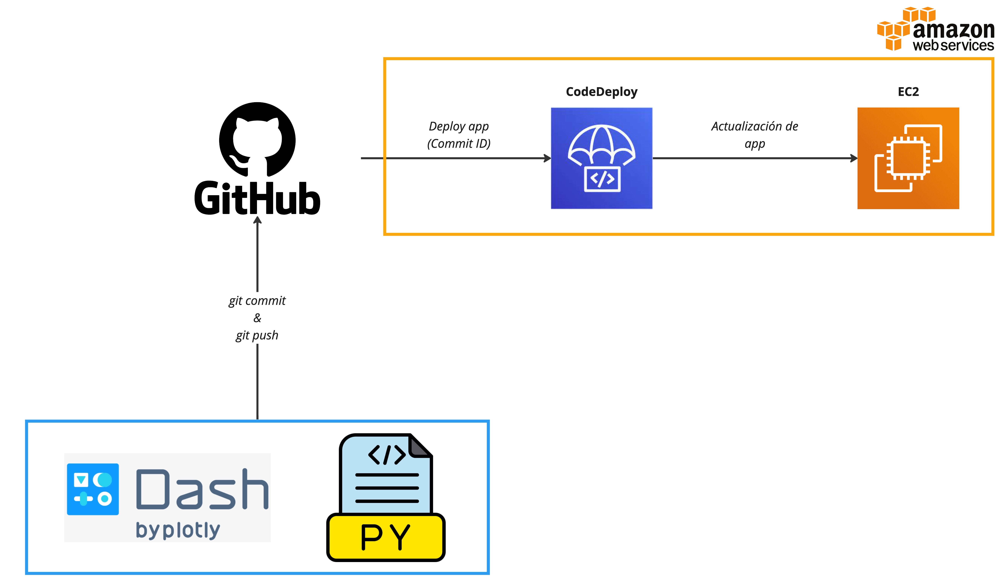

# Máster en Ciencia de Datos e Ingeniería de Datos en la Nube

## Módulo 14

### Daniel González, Javier Cózar, Jesús Martínez, Juan Ignacio Alonso

## Capstone XIV

---

En este capstone pondremos a prueba todo lo aprendido con respecto a la creación de aplicaciones visuales (_Dash_) y cómo crear un proceso "automatizado" para su puesta en producción y despliegue de nuevos cambios (_CI/CD con CodeDeploy_).

## Descripción

En este capstone partimos del problema planteado en el módulo IX donde desarrollamos una aplicación visual con _Dash_ en la que visualizabamos datos de accesos a nuestra aplicación web a través de varias redes sociales (_facebook_, _twitter_ e _instagram_).

Hemos detectado que mucha gente está accediendo a través de una nueva red social, _twitch_, por lo que hemos decidimos ampliar el dataset (fichero `social_network.parquet`) para que incluya los datos de esta nueva red social e incluya los datos en nuestra aplicación de Dash.

El código proporcionado en la carpeta `codedeploy-dash` incluye el código de la aplicación de Dash (`app.py`) actualizado para trabajar con los nuevos datos. El fichero `social_network.parquet` se encuentra en la ruta `s3://cidaen-m14-capstone-dataset/social_network.parquet`.

El objetivo de este capstone es el de crear un proyecto de CI/CD que, cada vez que subimos un nuevo commit a un repositorio en GitHub, despliegua la aplicación de Dash en una instancia de EC2 usando el servicio `CodeDeploy`. Lo ideal sería que el proceso estuviera orquestado mediante `CodePipeline` pero debido a que no tenemos permisos con AWS Academy usaremos `CodeDeploy` solamente. Podemos ver la interacción entre los diferentes servicios en el diagrama a continuación:

## Entregable

Se deberá realizar el capstone en el classroom del módulo 14. Asimismo se deberá subir este fichero `README.md` a la tarea de **campus virtual** completando en el primer paso de la sección `Pasos a seguir` la información requerida (url del repositorio de github público creado, el cual **deberá permanecer accesible al menos hasta su corrección**). Opcionalmente se podrá completar también la información solicitada en el último paso de la sección `Pasos a seguir` (se valorará positivamente).

## Pasos a seguir

1. Crear un repositorio **público** en GitHub. **<<INDICAR AQUÍ LA URL A DICHO REPOSITORIO>>**
   - El repositorio deberá inicializarse con el código proporcionado dentro de la carpeta `codedeploy-dash` (los siguientes comandos de git pueden ser necesarios `git init`, `git add`, `git commit`, `git push`)
2. Crear una instancia de EC2
   - Amazon Linux 2023 AMI 64-bit (x86)
   - Tipo t2.micro
   - Especificar el rol `LabRole` existente en AWS Academy
   - Especificar el nombre `cidaen-m14-capstone` para la instancia (se crea una `Tag` llamada `Name` con ese valor)
   - Especificar la opción `Create a new security group`
     - Añadir una entrada para SSH desde cualquier source
     - Añadir una entrada para HTTP desde cualquier source
   - Especificar la `Key Pair` vockey
   - Lanzar la instancia
3. Crear una aplicación de CodeDeploy
   - Compute platform: EC2/On-premises
4. Crear un Deployment Group
   - Seleccionar el rol `LabRole`
   - Deployment type: `In-place`
   - Environment configuration `Amazon EC2 instances`
     - Especificar una `Tag` con Key `Name` y value `cidaen-m14-capstone`
     - En la sección Agent configuration with AWS Systems Manager seleccionar `Only Once` para que instale AWS CodeDeploy Agent con el primer deployment
   - Deployment settings: `CodeDeployDefault.AllAtOnce`
   - **Desactivar** la casilla de `Enable load balancing`
5. Crear un deployment en el Deployment Group.
   - Seleccionar `My application is stored in Github`.
   - Especificar el nombre de vuestro GitHub en _GitHub token name_ para conectar con vuestro GitHub (autorizar conexión).
   - Introducir en _Repository name_ el nombre completo de vuestro repositorio en GitHub tal que así `ACCCOUNT-NAME/REPO-NAME`.
   - Introducir en _Commit ID_ el último commit ID del respositorio.
   - Crear el deployment.
6. Verificar que el deployment se completa correctamente
7. Verificar que podemos acceder a la aplicación de _Dash_ desplegada en la instancia de EC2 usando su `DNS`
8. Efectuar un cambio en la aplicación. Para ello, modificaremos el código del repositorio cambiando el título de la aplicación (primer elemento `H1`) de tal manera que sea `'<TU NOMBRE> - Dashboard Social Networks'`. Desplegar el cambio (`git add`, `git commit` y `git push`)
9. Vuelve a realizar otro despliegue con CodeDeploy utilizando el último commit.
10. Verificar que la aplicación se actualiza.
11. **Opcional**: ¿Se te ocurre algún KPI que mostrar sobre la nueva red social twitch? Modifica la aplicación de Dash y despliega el cambio de forma similar a como se hizo en el paso 8 y 9. **Comenta y justifica a continuación** el cambio realizado.
